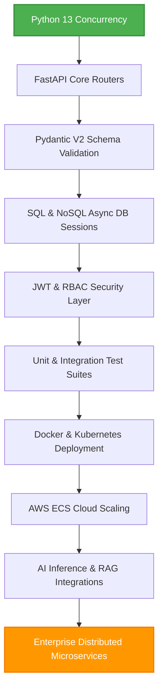

# FastAPI Complete Guide 2026

<p align="center">
  
  
  
  
</p>

## Welcome to the Future of Python Backends

The **FastAPI Complete Guide 2026** is an industry-standard technical handbook designed for modern backend developers, cloud engineers, DevOps practitioners, and software architects. 

Whether you are starting with zero framework knowledge or seeking to optimize a distributed, AI-driven microservice mesh on Kubernetes, this guide provides the exact production-ready codebases and architectural principles you need.

[Get Started :octicons-arrow-right-24:](getting-started/python_foundations.md){ .md-button .md-button--primary }
[Explore Codebases :octicons-code-24:](projects/end_to_end_projects.md){ .md-button }

---

## :book: Key Features

=== "Core Stack"
    * **Python 3.13+**: Utilize async concurrency, structured types, and subinterpreters.
    * **Pydantic V2**: Ultra-fast data serialization and schema verification written in Rust.
    * **SQLAlchemy 2.x**: Asynchronous persistence mapping, transactions, and Alembic migrations.

=== "Advanced Comm"
    * **WebSockets**: Live bi-directional chat rooms, telemetry channels, and notifications.
    * **Strawberry GraphQL**: Clean type-hint driven schemas, query optimization, and resolvers.

=== "Cloud & DevOps"
    * **Docker & Compose**: Slim multi-stage containerization using non-root user accounts.
    * **Kubernetes**: Production-grade Pods, ClusterIP Services, Ingress, and HPAs.
    * **AWS Integration**: Architecture configurations for ECS Fargate, ALB, S3, RDS, and API Gateway.

=== "AI & Agents"
    * **Model Serving**: Hosting Scikit-learn, PyTorch, and TensorFlow predictions inside thread pools.
    * **LLM Integrations**: Creating RAG agents using OpenAI, Google Gemini, and Anthropic APIs.

---

## :map: The 2026 Learning Roadmap



---

## :gear: Getting Started Locally

To run this documentation portal locally on your environment, follow these three commands:

```bash
# 1. Install MkDocs with the Material theme
pip install mkdocs-material

# 2. Launch the local live-reload development server
mkdocs serve

# 3. Compile the static optimized website for deployment
mkdocs build
```

Once the development server is running, navigate to `http://127.0.0.1:8000` in your web browser.

---

## :people_holding_hands: Contribution Guide

This guide is open-source. We welcome contributions to enhance code examples and correct errata:

1. **Fork the Repository**: Copy the source files to your account.
2. **Commit Changes**: Follow PEP-8 styling standards for code and write clear commit descriptions.
3. **Submit a Pull Request**: Explain your modification and detail how you verified it locally.
